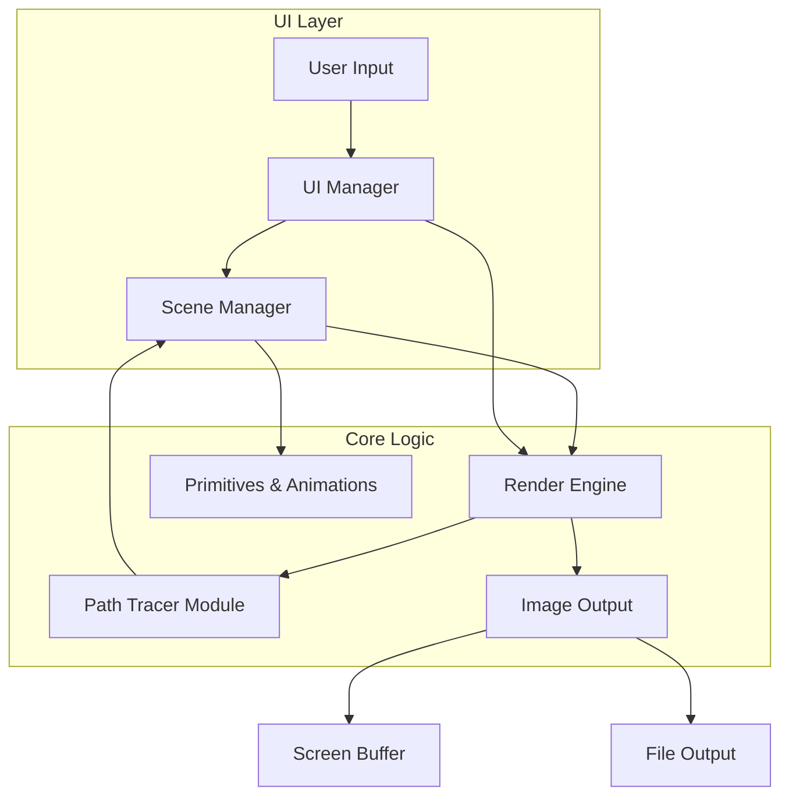

### System Architecture Document: Basic Render Pipeline

#### **1. High-Level Architecture**

The **Basic Render Pipeline** is a self-contained desktop application with a clear separation of concerns. The architecture follows a classic rendering pipeline model, where data flows from a scene description through a series of modules to produce a final image. The user interface is an integral part of this pipeline, rendered directly by the application itself.

-----

#### **2. Component Breakdown**

  * **UI Layer:** This is the user-facing part of the application. It's a self-rendered, 2D overlay on top of the 3D scene.

      * **UI Manager:** Translates raw mouse and keyboard input into UI-specific actions. It handles events like button clicks and checkbox toggles.
      * **UI Input:** The windowing library (e.g., SDL or GLFW) provides raw input events.
      * **Image Output:** The final rendered pixels are sent to an internal screen buffer for display.

  * **Core Logic:** The "back-end" of the application, which contains the rendering and scene management services.

      * **Scene Manager:** This service maintains the state of the 3D world. It stores all primitives, their properties, and light sources. It provides an API for the UI to add, remove, and modify objects.
      * **Primitives & Animations:** This module contains the data structures for each primitive (torus, sphere, pyramid, cube) and the logic for their spinning animations. It's managed by the `Scene Manager`.
      * **Render Engine:** The main orchestrator of the rendering process. It initiates the rendering thread, manages the `Path Tracer`'s execution for each pixel, and sends the final image data to the `Image Output` module.
      * **Path Tracer Module:** The heart of the renderer. It implements the path tracing algorithm, including ray generation, intersection tests, and light simulation. It queries the `Scene Manager` to get information about the scene.
      * **Image Output:** This module handles the final pixel data. It writes the image to the screen buffer for display and can also save the image to a file.

-----

#### **3. Technology Stack**

  * **Programming Language:** C++17 or newer.
  * **Build System:** CMake.
  * **External Libraries:** SDL or GLFW for windowing and input.
