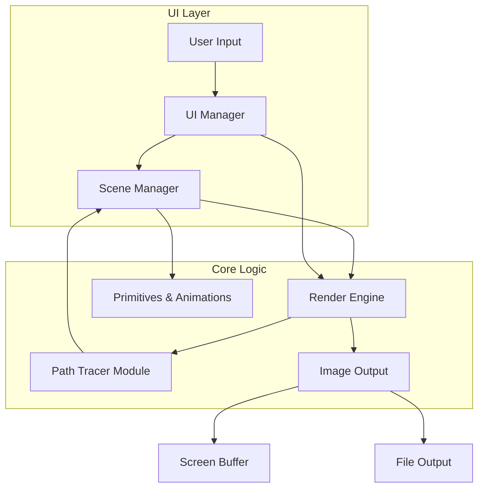

# System Architecture: High-Level Architecture

The Basic Render Pipeline is a self-contained desktop application with a clear separation of concerns. The architecture follows a classic rendering pipeline model, where data flows from a scene description through a series of modules to produce a final image. The user interface is an integral part of this pipeline, rendered directly by the application itself.

